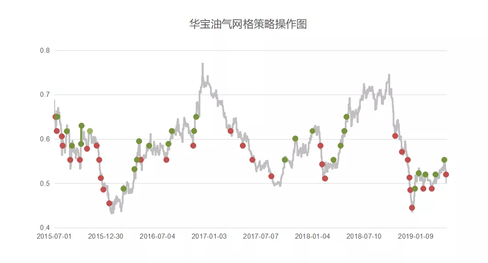

# 波段策略.网格之二：网格策略基础/1.0版
原创： ETF拯救世界  长赢指数投资  5月6日

始于年初的这波上涨，最近回调不少。尤其是今天开盘，受利空消息影响，大幅暴跌。这种时候，波段策略的优势就充分体现了出来。与长期持有也许会经历不断坐电梯不同，波段策略可以吃到震荡时期每一个波段的利润。

金融投资最重要的是什么？

是低买高卖。

## 壹：概述

踏踏实实的踏踏

我们先谈谈网格策略的整体思路。

 

如你所知，人类对金融市场的中短期走势并没有预测天赋。说自己有天赋的，不是傻子就是骗子，无一例外。当然，长期则不同。好东西长期看大概率会涨，这也是理性投资者能获得收益的根源所在。

 

然而长期究竟有多长，很难有个定义。也许明天就能价值回归，也许十年后，也许二十年后。除去基本面的因素，还有很多外部因素也许会导致很久很久，甚至二十、三十年那么久某类金融产品无法上涨。所以即使长期，也未必100%就一定会有好事发生。

 

所以你应该理解，我们应对的金融市场，至少中短期的未来，就会有三种走势：上涨、震荡、下跌。我们要做的，是让自己在任何一种可能发生的时候，无论从事实有又或者心理层面，保持冷静。

 

其实有意思的地方在于，在金融市场，你的行为与心理通常会一荣俱荣，一损俱损。良好的心态可以让你做出理性的行为，而理性的行为取得的好收益反过来又会让你的心态更好。相反，你可以观察失败的投资者，一定是心理状态影响操作，而差劲的操作又影响心态。所谓无论胜利还是失败，都是一种习惯，也跟这个情况有很大关系。

 

如何在震荡市中保持良好的收益与心态，这是每一个投资人都应该考虑的。不要说死死拿住就等爆发的那一天。一小部分人可以做到，对于大多数投资者来说，收益率像电梯一样起起伏伏是不可接受的。他们会因为上一次在高点没卖跌了下去，下次就会随时卖出，最终与大钱擦身而过。

 

网格策略就是一种可以帮你在震荡市中获取一定收益，以及极大缓解焦虑的优质策略。然而，所谓“优质”的前提，是你一定要深刻理解和认识它。尤其是它的弱点。

 

具体到网格的基础策略，就非常简单。一段话可以说清我对基础策略，即1.0版的认知：

 

开始网格，你需要做的事情非常简单：

 

第一步：确定交易品种。

 

第二步：列出网格表格。表格中包括交易价格、交易金额、交易日期。

 

第三步：做压力测试。

 

第四步：设置交易提醒。

 

第五步：按照交易提醒进行交易。

## 贰：适用范围

踏踏实实的踏踏实实的

开始网格策略前，你需要确定的是适用该策略的交易品种。

 

我给你一个适用范围底线：你要做网格的品种，一定是有底的品种。也就是说，不会死的品种。这句话是你在这篇文章中需要牢记的第一句话。

 

所以，会死的就不行。什么会死？比如个股。

 

我不是说个股一定会退市，凉透了那种死。它如果基本面发生变化，这辈子也涨不回来了，在网格策略中，也算死了。所以，我极力不推荐你用网格策略做股票。

 

除了个股，还有其他的类似特征品种，也坚决不能做。

 

只要是不会死的品种，就可以通过最宽松的筛选，进入你的选择视野。

 

更严格一点，当然品种之间会有不同。比如有的不死品种长期会一路上涨，你做网格，别说用1.0，即使用2.0也很难赚大钱。但我不是说不能做，也能做，效率会差一点。

 

最佳品种，当然是那些没完没了的上下折腾，几年后回头一看我去你怎么一点都没动啊。这种品种简直可以说是网格策略的最佳伴侣，如果你能找到一个，基本上就等同于你找到提款机了。

 

当然，长期会缓慢上涨的也可以做。只要你把网格和你的长期持有策略结合就好。这样，你获胜的概率就变成了2/3——一个品种上涨、下跌、震荡三种可能性中，你已经能搞定两个可能性，基本上你已经赢了。再想想办法，把下跌也解决掉，你在资本市场还会输吗？

## 叁：压力测试

踏踏实实的踏踏实实的

一定要做好压力测试。网格策略最关键的地方不是能赚多少钱，而是你可以知道最坏情况发生后，自己的账户会怎样。有了这样的准备，无论从策略设计本身又或者你的心态，都会受益匪浅。所以，这是你在本篇文章中要记住的第二句话：压力测试是最重要的。

 

怎么做压力测试？

 

很简单。设计交易表格的时候，根据具体情况，模拟最大下跌幅度。比如说，你现在要开始一个中证500的网格，那你就应该知道，下跌60%，几乎一定是最坏情况了。甚至下跌50%也非常困难。那么你如果相对来说激进一点，就可以以40%设计压力测试。保守一点，就按照50%或者60%设计。

 

如果你真的不知道到底应该给多少最大下跌空间，你可以参考ETF计划里面每次关于指数最大跌幅的判断。在那个基础上，再加10%基本上就是铁底。

具体如何交易，我接下来会说。但我再说一遍，压力测试一定要做。一定。因为这是最重要的。

## 肆：关于交易价格的几个细节

踏踏实实的踏踏实实的踏踏实实的踏踏实实的

第一个，设定交易价格。

 

回到设计表格这个步骤。打开excel，或者自己画一张表，列好买卖交易价格、交易金额、交易日期。

 

其中价格部分，如果从1开始，以5%幅度为一网，则买入价格分别为：1、0.95、0.9、0.85、0.8……卖出价格除第一网1.0买入的要在1.05卖出外，其它每一网都是上一网的买入价格。即，0.95买入的一网，1元卖出；0.9买入的，0.95卖出，依次类推。

 

所以，你1元买入的部分，在1.05清仓，赚到5%利润。0.95买到的，在1元清仓，赚到5.26%……最终，在0.7元买入的部分，0.75清仓，则这部分收益率就可以到7.14%。

 

你可以想象一下，如果一个品种不断地在20%-30%范围内波动，你不断的用5%网格收割，收割完成后将资金买入货币基金，那么这部分资金的年化收益率会非常令你满意。

 

所谓网格，就是我们要织一个密不透风的大网，将每一笔进入这个大网的利润吃掉。

 

下面是一个例子表格，供你参考。

是的，这就是一个最基础版本的网格交易模板。非常简单、粗暴、易用。我称之为1.0系统。要理解2.0和3.0，你必须搞清最基础的1.0。更重要的，你要知道这个策略最关键的点在哪里。

再来一张过去几年华宝油气应用网格1.0的情况：

可以看出，从开始的时候到现在，价格一路波动涨涨跌跌，最终不仅没涨还跌了。但你哪怕只用1.0，每一笔都在低买高卖，整体看也有非常不错的收益。这不是因为你操作能力强，而是因为你用对了策略。

 

第二个细节，关于开始的时机。

 

最好的开始时机，是价格略低于价值的时候。价格太高，买入的部分很难赚钱。价格太低，赚不了几次就飞了。

 

至于什么时候是价格略低于价值，很难给你一个统一的标准。你可以观察ETF计划，如果我们开始买入，就至少说明这个东西不太贵了。

 

第三个细节，关于网格大小。

 

1.0系统中，普通的品种我一般给5%。波动大的品种，比如券商指数，我给10%。供参考。

 

第四个细节，走势相似的品种不要重复开。

 

比如，都是大盘股指数，50和300你就别开两个网格了。占用资金过多也不是好事。意义也不大。

## 伍：挂单以及交易提醒

踏踏实实的踏踏实实的踏踏实实的踏

有些品种，比如银行纸白银或者纸黄金，就我所知甚至可以无限期挂单。这样的系统对网格交易就极为友好。你可以按照预订价格，上下各挂2、3网，然后去吃喝玩乐。当价格走势碰到你设定的价格，系统会提示你成交，然后你再去加一档买入卖出，继续去吃喝玩乐。

 

有些品种则不支持长期挂单，比如绝大多数ETF。这时候你就需要交易提醒软件。这个我也不推荐了，很多交易软件都可以实现。PC也有，手机也有。当价格碰到你的设定价格，警报跳出，你打开软件交易下单，然后关闭软件，又去吃喝玩乐。

 

当然，如果你能自己写挂单交易软件自动运行，或者雇一个交易员那就是最完美。

这样你就可以一直吃喝玩乐了。

## 陆：语重心长的提示

踏踏实实的踏踏实实踏踏实实的

世界上没有完美的交易策略。我告诉你，绝对没有。没有策略可以让你在下跌时候不赔钱，上涨时候赚大钱，震荡市提款。没有。就像没有任何投资者可以在每一个时间段内表现出色。即使长期看最牛的投资者也做不到。

 

所以，你需要组合你的策略。将中短期策略与长期策略组合，来应对未来可能发生的事。根据上一篇文章中提到的观察系统带来的观测结果，将不同权重动态分配在各个交易策略上。通俗的说，就是有时候中短期策略多分配一些资金，有时候长期资金多分配一些。

 

当然，你也可以从另一个角度思考：我能不能将中短期波动策略用某种方式与长期策略结合，来一定程度弥补它的固有缺陷（大牛市赚不到大钱）？为什么不可以？我们的2.0、3.0就是做这个的。之后细说，别急。

 

跑远了，拉回来。没有完美的策略，所以网格策略也一定不完美。有适合它的品种和周期，就一定有吃瘪的时候。但只要你从根本上认识它的缺陷，你就能改进它，或者做好足够的准备。我的意思，是千万不要对它寄予不切合实际的厚望。即使升级后，已经一定程度上弥补了固有缺陷，也远未完美。

 

最后，也请朋友们认真思考一下：这个交易策略的最大缺陷是什么？如果是你，你会如何弥补它？如果想不到，就回到上面看华宝油气那张图，认真看，仔细看，看到眼睛花了为止。

 

好了，让咱们一起期待下一篇文章的到来。其实我建议你看过升级版的网格策略再开始操作。不过如果你着急想试试1.0，也不是不行，但我建议你再把这篇文章读五遍。当然，你只读一遍也可以。不过未来你真的实践后再来看这篇文章，一定会后悔没有多读几遍。

 

知道为什么吗，

 

因为，

 

本人对近十年实践网格策略的失误和教训的反思和总结都在这篇文章里了。

 

这3511个字，会为你节省5-10年的试错时间。

 

它多么有价值，也许你永远都意识不到。

就像我的其它文章一样。

[阅读原文](https://mp.weixin.qq.com/s/-czfqGvxkDcay_tSI1jv5g)