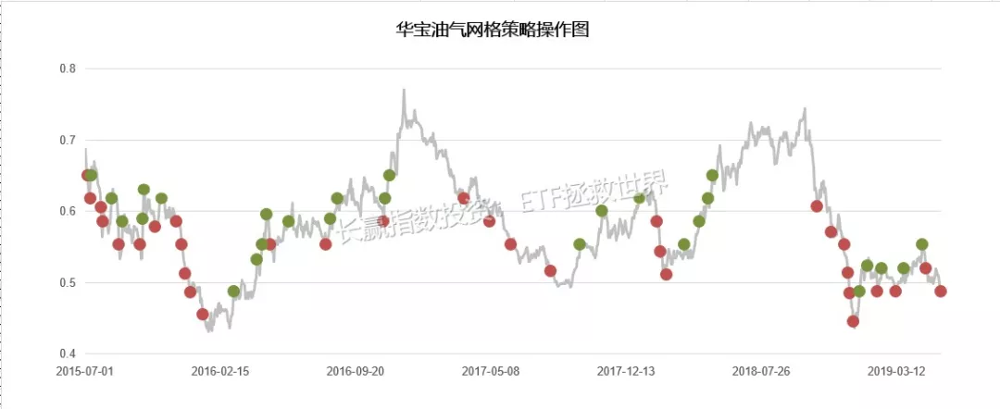
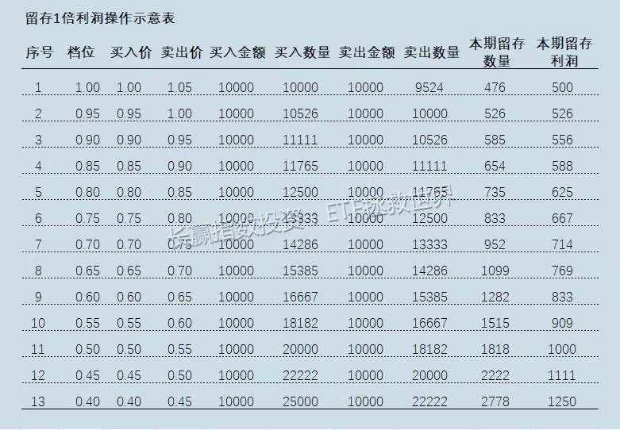
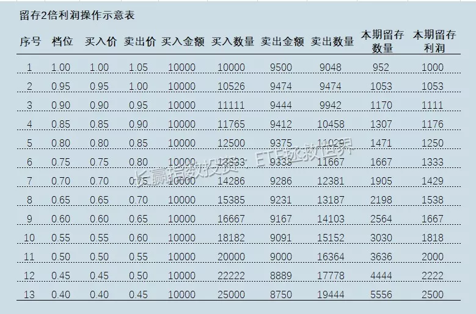
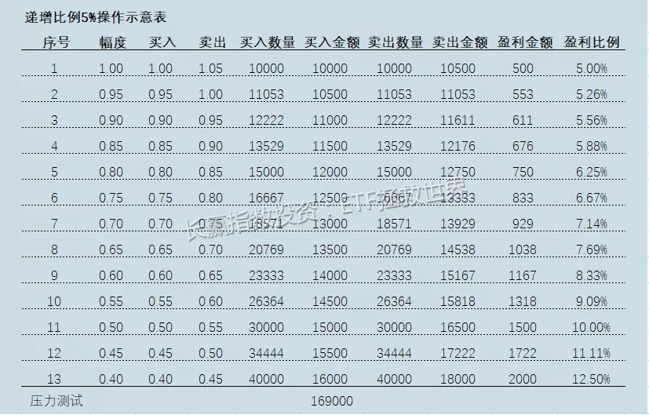
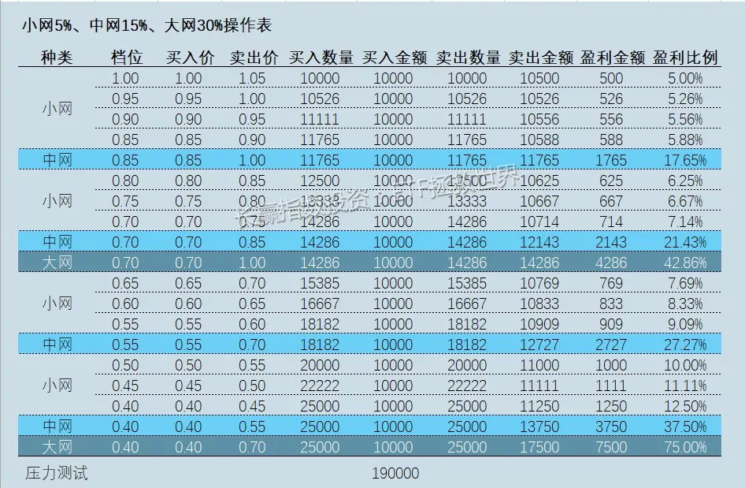
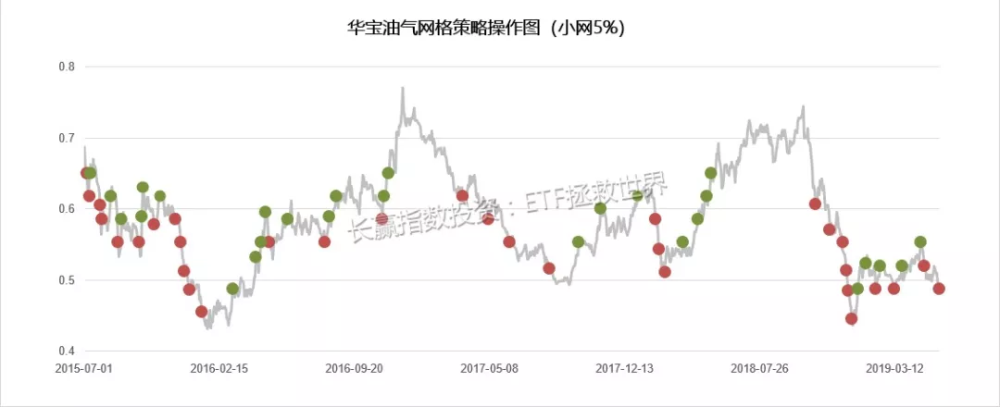
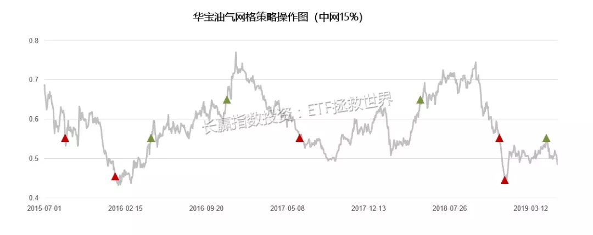

# 波段策略.网格之三：网格策略进阶/2.0版

二十天前，我把网格1.0基础原理、操作步骤以及注意事项写了一篇东西。今天，谈谈进阶版，即我一直在说的2.0版。

无论是1.0还是2.0，都是我个人的一些思考以及经验累积。问题和缺陷一定很多，然而没有关系，整个策略依然在不断进化和改善的路上。于我而言，投资体系以及投资策略，永远都在进步，永远都在不断完善。世界上没有完美的东西，今天比昨天进步，明天又比今天进步那就很好了。

## 壹：网格1.0的问题
踏踏实实的踏踏的踏踏实实的

上次让各位先自行思考网格1.0的问题。大家可以再看下面两张图，那么1.0的问题到底有哪些呢？

很明显，最大的问题在于，在一波强势上涨中，赚的不够多。大家看2015年底到2016年底这一波接近80%的暴涨中，你的每一格投入只赚了5%-8%。没错，你的所有投入都赚钱了，之后的下跌你也全都躲过了，但是我告诉你，99.9999%的人都会极度不满意自己的这波操作。尤其是当这个品种从0.4涨到接近0.8，你看着交易记录中自己在最低位买入的居然只赚了7%就卖掉了，一定悔恨不已。

然而如果你足够理性，你就应该知道，悔恨毫无用处。没有时光机器让你回到几个月前再来一次。所以你最应该做的，是改进你的交易策略，下次做得更好。

 

赚少了，没关系，我们升级。

 

我们的2.0，是由若干子策略集合而成。你可以组合使用，也可以单独使用。丰俭由人，各取所需。

## 贰：2.1/留利润
踏踏实实的踏踏实实的踏

2.0的第一个子策略，叫做留利润。

 

每一次网格卖出操作中，你可以把利润留下。因为这部分是0成本，所以你可以无限期持有。

 

金融心理学告诉我们，人们很容易把持仓品种分为不同的心理账户。那么，我们不如就将这部分0成本的利润，做为“免费得到”心理账户的品种，长期持有。无论它如何波动，因为是“赚来的”，所以在正常人的认知中，它都不会带来情绪化上的变化。

 

各位要知道，由于经济发展以及通胀的影响，绝大多数指数型品种长期看都会一路向上。所以你的网格利润自动转换成长期持有的部分后，会为你带来长期良好收益。

 

留利润子策略具体做法：

 

举例，1元价格买入10000元某品种10000份。1.05卖出10000元9524份，剩下的476份永不卖出，或者到极度高估的情况再卖。

这个子策略，你还可以继续进化。比如：留双份利润，留三份利润。怎么理解？你一格赚了5%，但因为这时候已经跌得太多了，你可以不仅留下5%的利润，还可以留下5%甚至10%的本金。

 

即，1元价格买入10000元某品种10000份。1.05留双份利润，卖出9048份9500元，500元利润与500元本金永不卖出，或者极度高估才卖。

## 叁：2.2/逐格加码

踏踏实实的踏踏实实的踏踏

这个很容易理解。

 

只要一个品种不会死，一定是价格越低价值越大。同时，见底以及波动的可能性也逐渐增加。所以，每一格增加一定投入，最终可以获取更大的利润。这也一定程度上缓解了1.0系统中底部利润过低的缺陷。

 

怎么加呢，永远要牢记压力测试的重要性。

 

列表格，列出最坏情况下自己是否还能坚持。然后逐渐加码，你可以尝试从第二格开始，每格比上一格加5%。算到最后你发现自己资金和心理状态扛不住了，没关系，那就从第三格开始加码，前两格用同样的金额。如果还是扛不住，那就从第四格开始。

 

如果你发现到最后自己的状态也非常轻松，那就每格增加7%，或者10%。总而言之，因为所有交易在交易开始前你就已经开始计划，所以无论如何调整都没有任何问题。只要你不过高或者过低估计自己的实际情况，那么怎么调整细节是非常自由的。

## 叁：2.3/一网打尽

踏踏实实的踏踏实实的踏踏

这是网格2.0系统的终极大招，会让利润疯狂奔跑的子策略。

 

各位可以想象一下，自己是出海打鱼的渔夫。这时候你需要面临选择：如果你带的网很密，那你会把所有小鱼抓走。但这样做的问题在于，你把所有小鱼苗都抓走了，它们永远也无法长成大鱼让你吃大肉。然而如果你带的网眼很大，确实能捞到大鱼，但碰到大鱼的机会很低，可能一年也抓不到一只。

 

那么，发挥你的聪明才智：能不能同时多撒几个网？

 

好了，2.3子系统登场。大网，中网，小网一起上。

 

如果把5%的网格当作小网，那么你可以再设置一个15%的中网，一个30%的大网。把你的资源分配到三个网格系统中。用5%的网格满足日常生活所需，15%的网格改善生活，30%的网格赚大钱。

 

什么？你说30%不是大钱？朋友，0.3/0.7=43%。大网第一网就是43%的利润，如果你有幸买到第二个大网，那么利润就是0.3/0.4=75%。够大不够大？

 

具体做法：

 

中网、大网操作方法与小网一致，但网格幅度升至15%以及30%。当然，这两个数字你也可以自己调整，比如10%和20%，又或者20%和40%。无所谓。

中网0.85、0.7、0.55……买入的，分别在1、0.85、0.7卖出。

大网0.7、0.4买入的，分别在1、0.7卖出。

 

依然是拿出表格，做压力测试。

有朋友问，为什么大网一网可以赚43%和75%，那么我们干嘛不把所有资源投入到大网上？还要做5%的小网？

 

很简单。未来是未知的。如果整个品种长期只在10%-20%的范围内波动，你的大网一网都赚不到，而别人的小网已经赚了很多。记得之前大鱼的例子吗。

这是华宝油气四年来大、中、小网操作示意图。

## 肆：写在最后

踏踏实实的踏踏实实的

网格策略是我整个投资体系中的一部分。如前所述，它有缺陷，但又不可或缺。

 

它能在震荡市中提供源源不断的利润；它能满足各位无处安放的交易欲望；它能避免上上下下坐电梯而又无法实现利润的焦虑感。

 

它不完美。世界上没有完美的人，没有完美的物，也没有完美的交易策略。我们要做的，是思考如何把不完美的策略，不完美的品种，有机的组合在一起，尽量让自己的交易体系生命力更强，更抗打击，更能茁壮成长，赚更多的钱。

 

从这几篇文章中，各位也应该能看到，我对事先计划有多么重视。总有朋友问我，我的某某股票套住了，怎么办？我的某某基金赚钱了/赔钱了，我该卖吗？

 

对我来说，这些问题无法回答。我说卖，明天开始暴涨怎么办？我说拿着，明天继续暴跌怎么办？我不知道这些问题的答案。我之所以不知道这些答案依然能在资本市场活得很好的原因，是我永远不会让这些问题出现在我的投资中。我的所有持有或者卖出计划，早在买入前就已经制定好。买入后无论上涨/波动/下跌，我都有预案。有朋友说我总是很淡定，这不废话吗，能不淡定吗？我在买入前都已经无数次沙盘推演现在情况出现后的情形，真发生了只是预料之中，有什么不淡定的？

 

最后，我想说，我的每一套策略都像我自己的孩子。这样事无巨细公开拿来供大家参考，其实还是并不舍得。但再想想，也就释怀。最重要的，是我认为这几篇文章能帮助很多朋友。因果循环，帮的人多了，自己也一定会更好，这并不坏。第二，毕竟只是体系中的一个策略，何况还在不断进化，拿出来大家一起思考没准能碰撞出更大的火花。

 

各位从这几篇文章里，无论从文字还是各种图表，都能看出我的诚意和用心。无论如何，如果能给你一点小小的启发，我就非常高兴了。

 

之前想说把网格3.0也一起拿出来供参考。但3.0的问题是与1.0和2.0相比，需要更多的主观判断，同时也远未完善，所以就暂时不说了。以后更成熟一些再拿出来与大家分享。

 

再说一次，如果你要尝试这个策略，请再阅读这三篇系列文章至少五次，把我着重强调的东西融合到你的交易计划中。这样，才有可能尽量减少你的试错成本。

 

祝各位投资顺利。

[阅读原文](https://mp.weixin.qq.com/s/8pRKsjiQSZzrmH-uWCkRLQ)